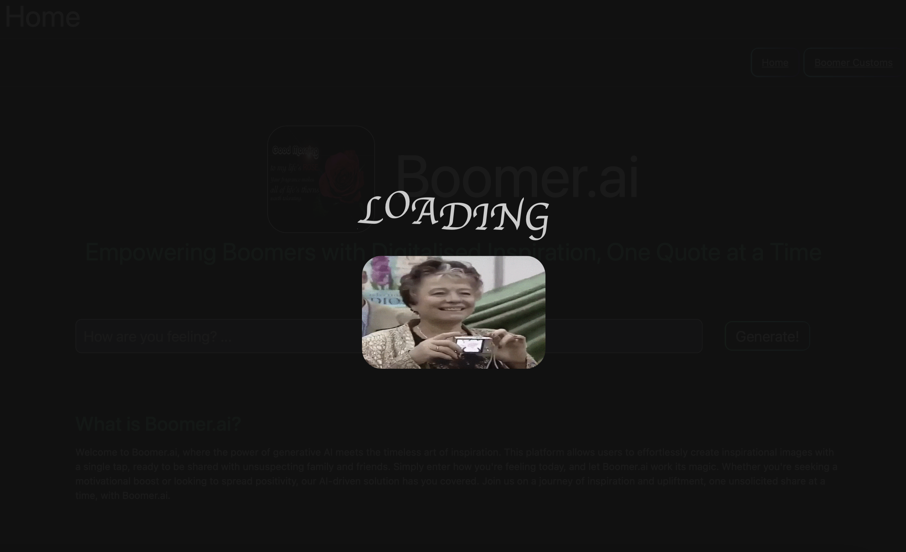

# Boomer.ai

## Description

### Boomer.ai

Empowering Boomers with Digitalised Inspiration, One Quote at a Time.

### What is Booomer.ai?

Welcome to Boomer.ai, where the power of generative AI meets the timeless art of boomer inspiration. This platform allows users to effortlessly create inspirational images with a single input, ready to be shared with unsuspecting family and friends. Simply enter how you're feeling today, and let Boomer.ai work its magic. Whether you're seeking a motivational boost or looking to spread positivity, this AI-driven solution has you covered.

## Overview

### Key Features

-   <strong>Generative AI:</strong> Utilizes OpenAI's GPT-3/4 chat completions and DALLE-3 API to crete personalised images and inspirational quotes.
-   <strong>User-friendly:</strong> With a single input, users can create inspirational quotes to share with others (unsolicitedly).
-   <strong>Saveable data:</strong> Users can easily save their favorite quotes for whenever they need a boost of inspiration.
-   <strong>Customisable:</strong> Users can customize their inspirational images by selecting their favourite combination of images and quotes.

### Screenshots

<figure>
      
      <figcaption>Boomer.ai</figcaption>
</figure>

<figure>
      
      <figcaption>Loading Screen</figcaption>
</figure>

<figure>
      
      <figcaption>Generated Quote</figcaption>
</figure>

<figure>
      
      <figcaption>Text/Image/Quote Saved</figcaption>
</figure>

<figure>
      
      <figcaption>Customisation</figcaption>
</figure>

## Installation

### Pre-requisites

This [application](https://stalwart-pothos-95b422.netlify.app/main) is currently deployed on [Netlify](https://www.netlify.com).

Before installation, you should:

### OpenAI

1. Create an account with to use their [API](https://platform.openai.com/docs/overview). Note that you need to charge your account wallet before usage.
2. On the API dashboard sidebar, go to `Settings` > `Billing` > `Add to credit balance` to add usage credits.
3. On the same API dashboard sidebar, go to `API keys` > click `Create new secret key`. Make sure to save it somewhere as it'll be hidden.
   
   

### Airtable

1.  Create an account on [Airtable](https://airtable.com)
2.  Generate your Airtable API key. Click `Account` > `Developer Hub`, then click `Create new token`. In the name field, enter your desired name. Add the following scopes/permissions:

    ```bash
    data.records.read
    data.records.write
    ```

3.  Take note of your Airtable API key as well.
4.  On the dashboard sidebar, click the + button to add a new workspace and click `Start from scratch`. This creates an empty table where you can add fields.
5.  Create another table, so now you'd have two tables. One table is for chat responses (GPT3/4) and the other for image responses (DALL-e).
6.  Rename the tables to your desire. Note that you have to change the environment variables accordingly.
7.  The chat response table should have the following fields

    | message: String | model: String | date: String |
    | --------------- | ------------- | ------------ |
    | someMessage     | someModel     | someDate     |
    | ...             | ...           | ...          |

8.  The image response table should have the following fields

    | image: String | date: String |
    | ------------- | ------------ |
    | someMessage   | someDate     |
    | ...           | ...          |

### Configuration

-   Git clone the [code base](https://github.com/andreteo/boomerai)
-   Change directory into boomerai `cd boomerai`
-   In your terminal/shell, install relevant packages: `npm i`.
-   Make a new .env file within the parent directory to include all your environment variables.
    > Note: Ensure that the .env file is INCLUDED in your .gitignore
-   Include the following environment variables

    > Note: Depending on whether you use Vite or create-react-app, please prepend your environment variables with `VITE_` or `REACT_APP_`

    | Framework        | Prepend     | Example                  | Importing                            |
    | ---------------- | ----------- | ------------------------ | ------------------------------------ |
    | vite             | VITE\_      | VITE_OPENAI_API_KEY      | import.meta.env.VITE_OPENAI_API_KEY  |
    | create-react-app | REACT_APP\_ | REACT_APP_OPENAI_API_KEY | process.env.REACT_APP_OPENAI_API_KEY |

    | Desc.                                    | Value                                        |
    | ---------------------------------------- | -------------------------------------------- |
    | {prepend}\_OPENAI_API_KEY                | From previous steps                          |
    | {prepend}\_OPENAI_CHAT_ENDPOINT          | https://api.openai.com/v1/chat/completions   |
    | {prepend}\_OPENAI_DALLE_ENDPOINT         | https://api.openai.com/v1/images/generations |
    | {prepend}\_AIRTABLE_API_KEY              | From previous steps                          |
    | {prepend}\_AIRTABLE_CHAT_TABLE_ENDPOINT  | From previous steps                          |
    | {prepend}\_AIRTABLE_IMAGE_TABLE_ENDPOINT | From previous steps                          |

## Usage

### Local Server

-   To start the local Vite server, enter `npm run dev`.
-   If your browser window does not start autoamtically, enter `localhost:<port number>` into the URL bar.

## API Request Structures

| Service                       | Method | Endpoint                                                                 | Parameters                                                              |
| ----------------------------- | ------ | ------------------------------------------------------------------------ | ----------------------------------------------------------------------- |
| OpenAI: GPT3/4                | POST   | https://api.openai.com/v1/chat/completions                               | [Reference](https://platform.openai.com/docs/api-reference/chat/create) |
| OpenAI: DALL-e                | POST   | https://api.openai.com/v1/images/generations                             | [Reference](https://platform.openai.com/docs/api-reference/images)      |
| Airtable: Get Chat Records    | GET    | https://api.airtable.com/v0/{baseId}/{chatTableName}                     | NIL                                                                     |
| Airtable: Get Image Record    | GET    | https://api.airtable.com/v0/{baseId}/{imageTableName}                    | NIL                                                                     |
| Airtable: Create Chat Record  | POST   | https://api.airtable.com/v0/{baseId}/{chatTableName}                     | Refer Below                                                             |
| Airtable: CreateImage Record  | POST   | https://api.airtable.com/v0/{baseId}/{imageTableName}                    | Refer below                                                             |
| Airtable: Delete Chat Record  | DELETE | https://api.airtable.com/v0/{baseId}/{chatTableName}?records[]={itemID}  | NIL                                                                     |
| Airtable: Delete Image Record | DELETE | https://api.airtable.com/v0/{baseId}/{imageTableName}?records[]={itemID} | NIL                                                                     |

**Airtable: Create New Records: Chat Records**

```json
{
    "records": [
        {
            "fields": {
                "message": "TESTING LAZ",
                "model": "gpt-3.5-turbo-0125",
                "date": "1710228333"
            }
        }
    ]
}
```

**Airtable: Create New Record: Image Records**

```json
{
    "records": [
        {
            "fields": {
                "image": "test",
                "date": "123455"
            }
        }
    ]
}
```

## Directory Structure

This section explains the directory structure of the code base.

```bash
.
├── node_modules
├── public
└── src
├── components
│   └── cssfiles
├── docs
├── fonts
└── media
```

### ./src

-   All source code are kept in `./src` directory.
-   React coponents are stored within `./components`.
-   CSS styles in `./components/cssfiles` are broken down into six categories: `Buttons`, `Image`, `Loading`, `Modal`, `Table` and `Text`.
-   Wireframes in `./docs`.
-   Fonts in `./fonts`.
-   Everything to do with media such as images or gifs are stored in `./media`.

## Known Limitations

Some known problems with the current implementation are

1. There is no easy way to save the image and text as a simple flat .jpg/.png file. Generated images and text are rendered on html directly. Therefore the user has to make a screenshot to capture.
2. Save quote duplication. Three buttons are implemented so that the user has the liberty to save their favourite text only/image only/entire quote. However, the user may actually click each of the three buttons sequentially, thus saving duplicates with the "Save Quote" button.
3. No duplicate handling in Airtable. With save quote duplication, the Dashboard page will GET all records and display images/text, even duplicates. As an interim, the front end code memoizes and displays only unique values. However, this does not solve the underlying issue yet. If a user were to delete a particular text and it just so happens that duplicates exist, it will re-appear on page re-render.
4. Image response from DALL-e are sent in URL form. This is of course easy to render in HTML, but difficult to save the image and text as a single image. Furthermore, OpenAI implements an image exiry of ~1 hour, which means the current implementation does not have persistent storage of images.
5. Considering this is a pure front end project with Airtable "database", there is no proper storage of image element. The image shape that DALL-e produces is (1024, 1024, 3), which produces a 3MB image. To prevent the URL expiry time, DALL-e can return the image in a Base64 string. This brings us to the next issue, a single image ~3MB is split into 6-bit characters `(3MB * 8 bits) / 6 = 4216928 characters`. This overly exceeds Airtable's [100k character limit](https://community.airtable.com/t5/other-questions/what-is-the-long-text-character-limit/td-p/128219) per record. Even if we break that single iamge down to 100k character substrings, we'd have to have minimum 43 substrings -> 43 Airtable API calls, which is not ideal.

## Next Steps

1. There needs to be a way to generate a downloadable and shareable flat image without manually having to screenshot.
2. Implementing a database, removes the need for any duplicate checking on the frontend.
3. Implementing a databse also allows us to store Base64 encoded images for persistent storage.
4. Only allow user to click one option (`Save Text Only`/`Save Image Only`, `Save Both`) to prevent saving of duplicates.
5. Implement a "Delete Mode" where the user can click and highlight any number of saved images/text to delete. A single button can then be clicked to mass delete. Instead of a singular delete button PER text/image. This also avoids having to send one DELETE request per item deletion.

## References

| Desc.                | URL                                                                |
| -------------------- | ------------------------------------------------------------------ |
| Loading Animation    | [Link](https://alvarotrigo.com/blog/css-text-animations/)          |
| Boomer Gif           | [Link](https://giphy.com/gifs/fail-camera-oops-3owypf6HrM3J7UTvAA) |
| Hex-to-RGB Converter | https://www.rapidtables.com/convert/color/hex-to-rgb.html          |
| CSS Gradient Finder  | https://cssgradient.io/gradient-backgrounds/                       |
